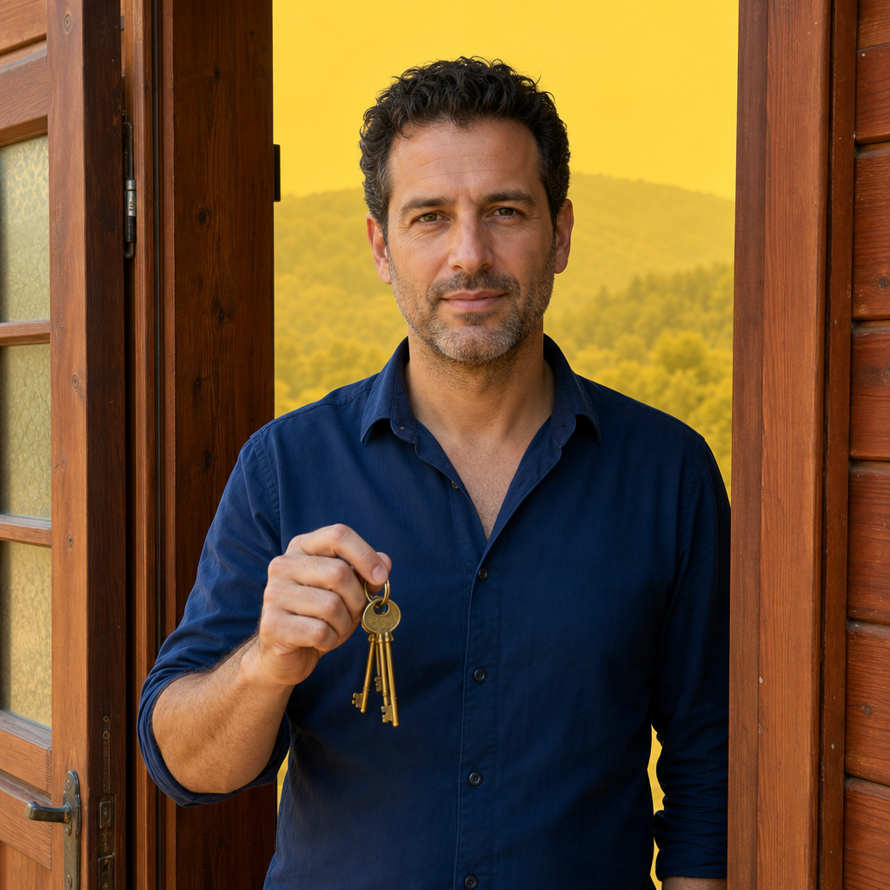
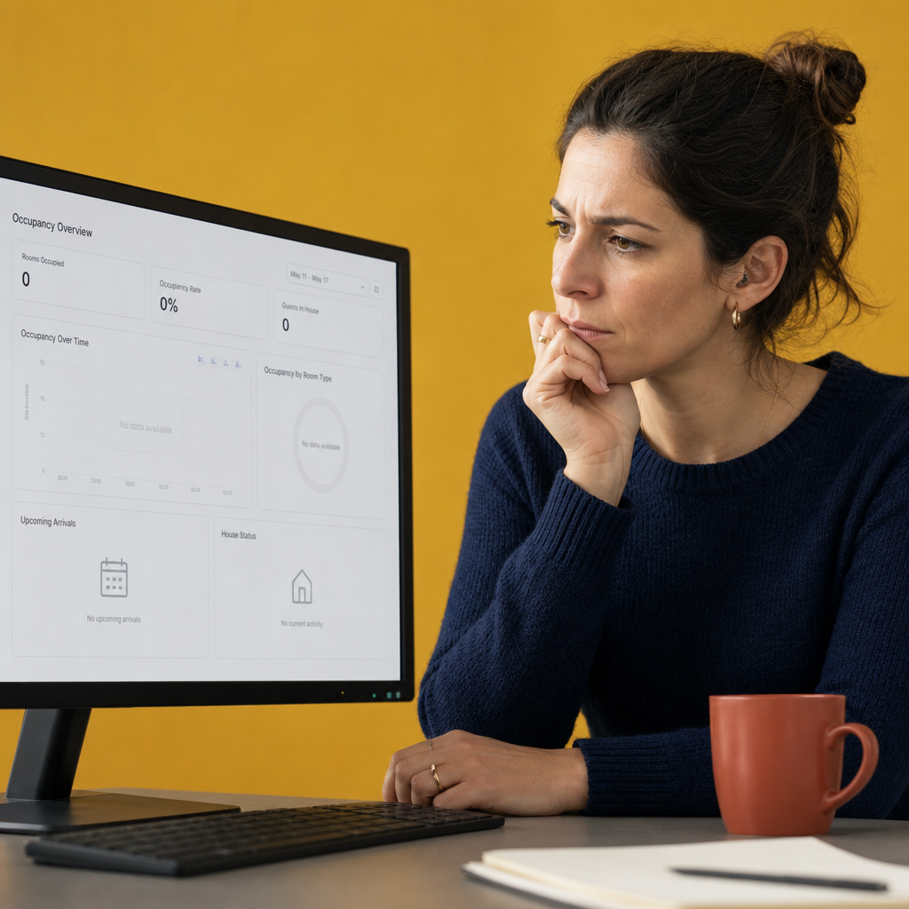
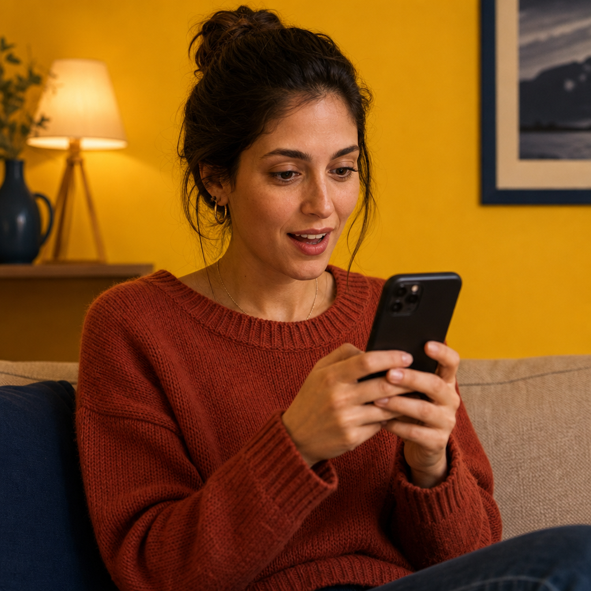

# הצפון חוזר לפעילות — ולמה דווקא רשתות חברתיות, ולא הפורטלים הוותיקים, יחזירו לכם את הלקוחות

הצפון חזר לפעול, אבל הוא עוד לא חזר לעצמו. בעלי צימרים, סוויטות ווילות שפתחו את השערים בשבועות האחרונים מדווחים על תפוסה נמוכה ב-50% עד 70% מהרמות שלפני המלחמה. זה לא רק "פחות לקוחות" — זה שוק אחר לגמרי. השאלות שהלקוחות שואלים השתנו, ציר הזמן של ההזמנות התקצר, וההרגלים הישנים של שיווק הצימר פשוט לא עובדים בו.

המאמר הזה לבעלי מתחמי אירוח בצפון שמרגישים שמשהו עמוק יותר השתנה — ושההשקעה בפורטלים שעבדה כל כך טוב בעבר, פשוט לא מחזירה את עצמה היום. ננסה להבין למה, ומה כן עובד.

## תמונת מצב: השוק לא חזר, הוא השתנה

הציטוט שהכי טוב מתאר את מה שקרה הגיע מבעל צימר באחד הקיבוצים בגליל:

> "בעבר אנשים היו מתקשרים ושואלים על ג'קוזי — עכשיו השאלה הראשונה היא אם יש לנו ממ"ד."

זה לא ציטוט שצריך להתעלם ממנו. זו תזוזה מהותית בקו ההחלטה של הלקוח. הלקוח של 2023 בחר חוויה — פינוק, רומנטיקה, ג'קוזי, אווירה. הלקוח של 2026 בודק קודם בטיחות, ורק אחר כך — אם הכל בסדר — מתחיל לחשוב על החוויה.

ובמקביל, ציר הזמן נשבר. בעל מתחם אחר תיאר את זה כך:

> "בשנה רגילה, אוגוסט היה מלא לחלוטין כבר במאי. עכשיו המצב הרבה יותר קשה."

לפני המלחמה — ה-lead time הממוצע של הזמנת צימר בצפון היה בערך 3 חודשים. היום, לפי דיווחים של בעלי מתחמים, אנחנו מדברים על שבועיים, לפעמים פחות. הציבור הישראלי לא מזמין מראש כמו פעם. הוא מחליט close-to-date, וגם זה — רק חלק מהאנשים שהיו מחליטים בעבר.

המשמעות העסקית: יש לכם פחות לקוחות, הם מחליטים מהר, והשאלה הראשונה שלהם היא ביטחונית. זה שוק עם דינמיקה שונה לחלוטין מזה שכל הכלים הקיימים — כולל הפורטלים — נבנו בשבילו.

## הקשר רחב יותר: כל הצפון, לא רק הצימרים

המצב לא ייחודי לאירוח. מנהל תיירות בצפון ניסח את זה בפשטות: **"איבדנו את עונת הקיץ. 40% מהפעילות התיירותית בצפון. תיירות הפנים לא חזרה בהמוניה."** בערך 50% מהעסקים בצפון חזרו לפעילות, אבל ההכנסות עדיין נמוכות באופן משמעותי. גם השיקום הציבורי בשלב מוקדם — 200 מיליון שקל הוקצו לשיפוץ מבני ציבור, 149 מיליון לפערי לימוד, וגם הסטודנטים — באוניברסיטאות הצפון — חזרו רק חלקית.

זה הקשר חשוב, כי הוא אומר שאתם לא לבד. השוק כולו במצב הזה. ומי שמבין את זה מהר וזז קדימה — מקבל יתרון.

מצד שני, בחודשים האחרונים נפתחו עשרות מתחמים מחדש — כפר נופש נופי גונן, מלון פסטורל בכפר בלום, מלון טבע גושרים (שהשקיע כ-10 מיליון שקל בשיפוצים בזמן הסגירה), מלון נופי דוד בכפר נחום, מלון כפר גלעדי שעבר שיפוץ דרמטי, מתחם צימרים אל-רום, עין זיוון, עורטל. הקיבולת קיימת. השאלה היא איך ממלאים אותה.

## הפורטלים הוותיקים — למה הם פשוט לא הכלי הנכון לרגע הזה

אם אתם מנהלים מתחם בצפון, סביר להניח שעד היום עבדתם בעיקר עם פורטלי האירוח הגדולים — Weekend, צימר R, היוקרה, הפסגה. ויש סיבה טובה: בשוק הקודם, הם עבדו מצוין.

הם עבדו מצוין כי הם בנויים על עיקרון אחד פשוט: **חיפוש אקטיבי**. הלקוח כבר החליט שהוא רוצה צימר בצפון. הוא נכנס לפורטל, מסנן לפי תאריך, מסנן לפי איזור, ובוחר. תפקיד הפורטל הוא לחתוך — להראות לו את האפשרויות שמתאימות לקריטריונים שלו.

הבעיה: בשוק הנוכחי, רוב הלקוחות הפוטנציאליים שלכם **לא נכנסים לפורטל**. הם לא יזמו את החיפוש. הם לא חושבים על צפון. הם זוכרים את הצפון של 2023 — את אזעקות אדום, את החדשות, את הפינויים — והם פשוט לא מעלים את האפשרות. הם חושבים על אילת, על אירופה, על להישאר בבית.

פורטל יכול להראות את הצימר שלכם רק למי שכבר מחפש. אבל הקהל שלכם — אלה שיכולים להזמין, יכולים לאהוב את המקום, פשוט עוד לא חזרו לחשוב על האפשרות.

יש כאן גם בעיה נוספת: בפורטל אתם מופיעים ככרטיסייה, ליד עוד 50 כרטיסיות. אין שם סיפור, אין שם אמון, אין שם נראות אישית. בשוק שצריך לבנות מחדש את התחושה ש"הצפון בטוח, יפה, וכדאי לבוא" — כרטיסייה עם מחיר ותמונה אחת לא תעשה את העבודה.

## רשתות חברתיות — בדיוק הכלי שהשוק הזה דורש

ההבדל המהותי בין פורטל לרשת חברתית הוא לא טכנולוגי. הוא פסיכולוגי.

פורטל = **חיפוש אקטיבי**. הלקוח יוזם.

רשת חברתית = **גילוי פסיבי**. הלקוח לא יוזם — התוכן שלכם מגיע אליו, כשהוא גולל אינסטגרם בערב על הספה, כשהוא רואה ריל של נוף גליל בטיקטוק, כשחבר שלו מתייג אותו מתחת לפוסט פייסבוק על סוף שבוע מוצלח בצימר שלכם.

זה בדיוק הפער שצריך לסגור עכשיו. הקהל לא מחפש אתכם — אתם צריכים להגיע אליו. ולא במסר פרסומי קר, אלא בתוכן שמזכיר לו שהצפון קיים, יפה, פעיל, בטוח. שאנשים מסתובבים שם. שיש מה לעשות. שזה לא רחוק.

יש כאן גם יתרון של אמון. כשלקוח רואה ריל אמיתי מתוך הצימר שלכם — עם הקול שלכם, עם הפנים שלכם, עם הסיפור של איך פתחתם מחדש, עם הצוות, עם הבוקר אחרי — הוא לא רואה פרסומת. הוא רואה אנשים אמיתיים. וזה מה שמעביר אותו מ"לא חשבתי על זה" ל"רגע, אולי כן".

הנקודה השלישית: lead time. אמרנו שהלקוח מחליט שבועיים מראש. זה אומר שאתם צריכים נוכחות שוטפת — לא קמפיין רבעוני בפורטל. אתם צריכים להיות בפיד של הלקוח בשבוע שהוא מחליט. רשתות חברתיות בנויות בדיוק לזה: פוסט, ריל, סטורי — תוכן מתמשך, יומי, חי.

## איך מתחילים — צעדים פרקטיים לבעל מתחם שלא חי ברשתות

נניח שעד היום הזרמתם תקציב לפורטלים, השקעתם בקצת SEO, ולא ממש עסקתם באינסטגרם או טיקטוק. מה עושים?

**1. מתחילים ממקום אחד — אינסטגרם.** טיקטוק חזק, פייסבוק עדיין רלוונטי, אבל אם אין לכם זמן ואנרגיה לשלושה — תתחילו רק באינסטגרם. שם נמצא הקהל הישראלי שמזמין צימרים: 28-55, רוב מאזורי המרכז, עם הכנסה שמאפשרת סוף שבוע בצפון.

**2. ריל ביום, או לפחות שלושה בשבוע.** ריל = סרטון קצר. לא צריך הפקה. הטלפון שלכם מספיק. רעיונות: סיור של דקה בצימר. הבוקר אחרי האורחים. שיחה איתכם בזמן שאתם מכינים את חדר האירוח. סרטון של הג'קוזי דולק עם נר. תמונה מהמרפסת בשעת זריחה. כל מה שמראה שהמקום חי, יפה, ופועל.

**3. סיפורי לקוחות.** עם רשות, צלמו או הקליטו אורחים שמדברים על החוויה. זה ה-social proof החזק ביותר. אורח שמספר "באנו עם חששות, יצאנו רגועים" — שווה יותר מ-100 פוסטים פרסומיים.

**4. before / after.** אם שיפצתם בזמן הסגירה, או הוספתם משהו, או שדרגתם — תראו את זה. אחד הסיפורים הכי חזקים בשוק הנוכחי הוא של מתחמים שהשתמשו בזמן הקשה כדי לבנות משהו טוב יותר. מלון טבע גושרים השקיע 10 מיליון שקל. מלון כפר גלעדי עבר שיפוץ דרמטי. גם אתם, אם עשיתם משהו — תספרו.

**5. סיפור הפתיחה מחדש.** ספרו את הסיפור שלכם. למה פתחתם, מה היה קשה, איך זה מרגיש לראות אורחים חוזרים. אנשים מתחברים לאנשים, לא לחללים.

**6. תפעול: או אדמין שעובד, או יוצר תוכן.** אם אין לכם זמן או נוח לכם מאחורי המצלמה — תזכרו: יש היום עשרות יוצרי תוכן ואדמיני סושיאל שעובדים בתקציבים סבירים. תקציב חודשי של 1,500-3,000 שקל לאדמין שמפיק עבורכם 3 ריאלס בשבוע + סטוריז יומי, ייתן יותר תוצאות מ-3,000 שקל בפורטל. במיוחד בשוק הזה.

**7. תקציב פרסום מבוקר.** אחרי שיש לכם תוכן, אפשר לקדם פוסטים מוצלחים בתקציב נמוך — 30-50 שקל ליום — לקהל ממוקד גיאוגרפית ודמוגרפית. זה זול בהרבה ממה שאתם משלמים היום על פורטל, ומגיע ללקוחות שלא היו מגיעים אחרת.

## בשורה התחתונה

הפורטלים לא מתים. הם עדיין מקור לידים, ועדיין יש מקום לכרטיסייה שלכם שם. אבל בשוק הנוכחי — שוק שצריך לבנות מחדש את הביקוש עצמו, לא רק להיכנס לתוכו — הם לא יכולים להיות המנוע המרכזי.

המנוע המרכזי היום הוא נוכחות ברשתות. תוכן שמזכיר לישראלי על הספה, ביום שלישי בערב, שהצפון עוד פה, שהוא יפה, שהוא חי, ושיש שם אנשים שמחכים לקבל אותו. אם תעבירו אפילו 30%-40% מהתקציב והאנרגיה שלכם מהפורטלים הישנים לאינסטגרם — סביר להניח שתראו את התוצאה בתפוסה תוך 2-3 חודשים.

תקופה כזו לא חוזרת על עצמה הרבה פעמים. מי שבונה נוכחות עכשיו, בעוד שנה תהיה לו קהילה. ובשוק שהזיכרון הקצר שלו עוד שולט בו, קהילה — זה ההבדל בין מתחם שמתאושש לאט, למתחם שכבר מלא.
